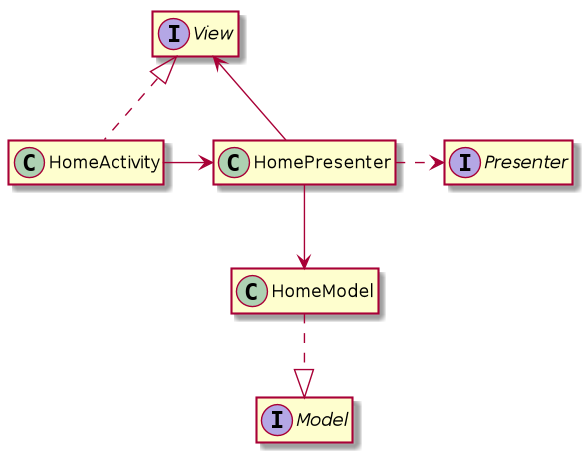

[](https://github.com/xujiaji/XMVP/releases) [](https://bintray.com/xujiaji/maven/xmvp/1.2.3)

# XMVP
This is a mvp framework to help you easily achieve mvp structure.

中文文档: [XMVP（简洁的MVP框架）](https://juejin.im/post/5a31ecfaf265da4325294fa9)

## Update
```
> v1.2.3-androidx change to androidx library

> v1.2.3 add onPresenterCircle method

> v1.2.2 Fragment lazy load data, and add cycle function in View. Fix some bug.

> v1.1.5 Can not create Presenter after fixing obfuscation

> v1.1.4 fixes the subclass Activity of the current Activity crashes because it can not create a Presenter.

> v1.1.3 Called after the start() method in Presenter has been put into View's onInit() method.

> v1.1.2 XBasePresenter add judgment to determine whether the view still exists.

> v1.1.1 Add a fragment of the extended V4 package in the 'io.xujiaji.xmvp.view.base.v4' package.
```

## Introduction
- You can call the method in step 2 directly through the presenter in the Activity or Fragment
- You can call the definition of the View interface in Presenter method, and can be called by model in step 2 Model implementation of the class method
- and the start and end methods in Presenter for the start and end of the Activity and Fragmentt lifecycle.
- through XMVP you do not care about View, Presenter, Model is how to connect, you can easily decouple the project.
- Finally you can easily build the code using the '[MVPManager](https://github.com/xujiaji/MVPManager)' plugin


## How to use?

### First, Add xmvp dependency
```
dependencies {
    implementation 'com.github.xujiaji:xmvp:1.2.3'
}
```
or

[](https://github.com/xujiaji/XMVP/releases)

> use androidx

```
dependencies {
    implementation 'com.github.xujiaji:xmvp:1.2.3-androidx'
}
```
### Step1:define a contract
You need to define a contract in contracts package, it contains a extend 'XContract.Presenter' interface and a extend 'XContract.View' interface.
> Example: [HomeContract.java](./sample/src/main/java/io/xujiaji/sample/contract/HomeContract.java)

``` java
public interface HomeContract {
    interface Presenter extends XContract.Presenter{
        void loadData(Activity activity);
    }

    interface View extends XContract.View{
        void loadStart();
        void loadEnd(List<FileEntity> fileEntities);
    }

    interface Model extends XContract.Model {
        void scanFile(final Activity activity, final FileHelper.Listener<List<FileEntity>> listener);
    }
}
```

### Step2:An implementation class for the Model interface.
> Example: [HomeModel.java](./sample/src/main/java/io/xujiaji/sample/model/HomeModel.java)

``` java
public class HomeModel implements HomeContract.Model {
    @Override
    public void scanFile(final Activity activity, final FileHelper.Listener<List<FileEntity>> listener) {
        ...
    }
}
```

### Step3:An implementation class for the Presenter interface.
> Example: [HomePresenter.java](./sample/src/main/java/io/xujiaji/sample/presenter/HomePresenter.java)

``` java
public class HomePresenter extends XBasePresenter<HomeContract.View, HomeModel> implements HomeContract.Presenter {

    @Override
    public void loadData(Activity activity) {
        view.loadStart();
        model.scanFile(activity, new FileHelper.Listener<List<FileEntity>>() {
            @Override
            public void success(List<FileEntity> fileEntities) {
                view.loadEnd(fileEntities);
            }
        });
    }
}
```

### Step4:An implementation class for the View interface.
> Example: [HomeActivity.java](./sample/src/main/java/io/xujiaji/sample/view/HomeActivity.java)

``` java
public class HomeActivity extends XBaseActivity<HomePresenter> implements HomeContract.View {
    ...

    @Override
    public void onInitCircle() {
        ...
        presenter.loadData(this);
    }

    @Override
    public void onListenerCircle() {
        ...
    }

    ...

    @Override
    public void loadStart() {
        ...
    }

    @Override
    public void loadEnd(List<FileEntity> fileEntities) {
        ...
    }

    @Override
    public int layoutId() {
        return R.layout.activity_home;
    }
}
```

#### You think this MVP too much trouble?
MVPManager helps you manage MVP code quickly.
[link MVPManager](https://github.com/xujiaji/MVPManager)

#### Home UML


# License
```
   Copyright 2016 XuJiaji

   Licensed under the Apache License, Version 2.0 (the "License");
   you may not use this file except in compliance with the License.
   You may obtain a copy of the License at

       http://www.apache.org/licenses/LICENSE-2.0

   Unless required by applicable law or agreed to in writing, software
   distributed under the License is distributed on an "AS IS" BASIS,
   WITHOUT WARRANTIES OR CONDITIONS OF ANY KIND, either express or implied.
   See the License for the specific language governing permissions and
   limitations under the License.
```
